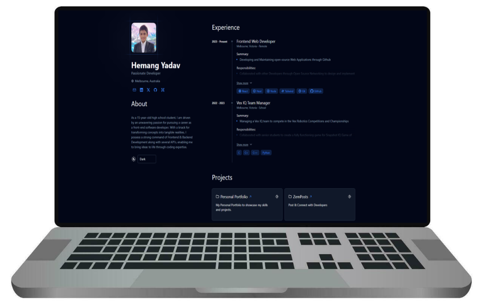
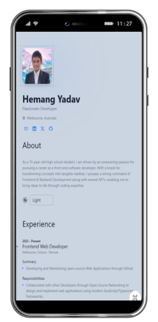

<p align = "center">


<br>

<br>


</p>

<h1 align = "center">
  Zemerik's Resume
</h1>

<p align = "center">
    A Dynamic Resume
</p>

<p align = "center">
  
</p>

## ❗About:


Welcome to my Dynamic Resume! Explore a concise yet powerful overview of my professional journey, skills, and accomplishments, all presented in a clean, impactful format. This résumé provides a quick yet thorough insight into my expertise, education, and experience, tailored for easy navigation and readability. Whether you're looking to understand my career path, evaluate my qualifications, or simply get a glimpse of the value I bring, this dynamic display offers a streamlined and modern presentation of who I am. Dive in, explore, and see how my background aligns with your needs!

## ⭐ Key Features:

- Explore My Experiences

- Print My Resume

- Toggle Between Themes

- Showcase Projects

- Check My Skills:

- View Educational Background

## 📱 Guide:

### Window Users:

- `CTRL` + `K` = View Commmand Palette
- `CTRL` + `P` = Print Resume
- `CTRL` + `L` = Visit Linkedin
- `CTRL` + `X` = Visit X
- `CTRL` + `G` = Visit Github
- `Esc` =  Close Palette

> Up & Down Arrows to Navigate

> Enter to Select

### MacOS Users:

- `CMD` + `K` = View Commmand Palette
- `CMD` + `P` = Print Resume
- `CMD` + `L` = Visit Linkedin
- `CMD` + `X` = Visit X
- `CMD` + `G` = Visit Github
- `Esc` =  Close Palette

> Up & Down Arrows to Navigate

> Enter to Select


> [!Note] 
> Feel free to open [Pull-Requests](https://github.com/Zemerik/Terminal/pulls) for more Commands / Shorcuts. 

## 💻 Screenshots:



## 🚀 Quick Start:

### Prerequisites:

- [NodeJS](https://nodejs.org) installed on your machine
- [GIT](https://git-scm.com) installed on your machine
- A Code Editor

### Cloning:

- To make a local copy of this Project on your machine, enter the following `GIT` Commmand in your Terminal:

```bash
git clone https://github.com/Zemerik/Resume
```

### Installing Dependencies:

- To run this project locally, we first need to download a few `npm` dependencies by using the command below:

```bash
npm i
```

### Locally Running:

- We can locally run this Project on our Network and see the output using the following Command of `NodeJS`:

```bash
npm run dev
```

## 😎 Happy Coding!!

## 🚀 Project Structure

```text
├── public/
│   ├── themes/
├── src/
│   ├── components/
│   ├── icons/
│   ├── layouts/
│   └── pages/
├── .gitignore
├── .prettierrc
├── astro.config.mjs
├── README.md
├── CODE_OF_CONDUCT.md
├── CONTRIBUTING.md
├── SECURITY.md
├── Licence
├── cv.json
├── package.json
├── package-lock.json
├── pnpm-lock.yml
├── tailwind.config.mjs
└── tsconfig.json
```

## 🤝 Contributing:

Contributions are always welcome and appreciated! **Kindly visit the [CONTRIBUTING.md](https://github.com/Zemerik/Resume/blob/main/CONTRIBUTING.md) file for more information**


## 💁 Support:

For any kind of support or inforrmation, you are free to join our **Discord Server**,

<a href = "https://discord.gg/UF9KsmuGbr">
  
</a>

#

<p align = "center">
  Don't forget to leave a ⭐
  <br>
  Made with 💖 by <a href = "https://github.com/Zemerik">Hemang Yadav (Zemerik)</a>
</p>
